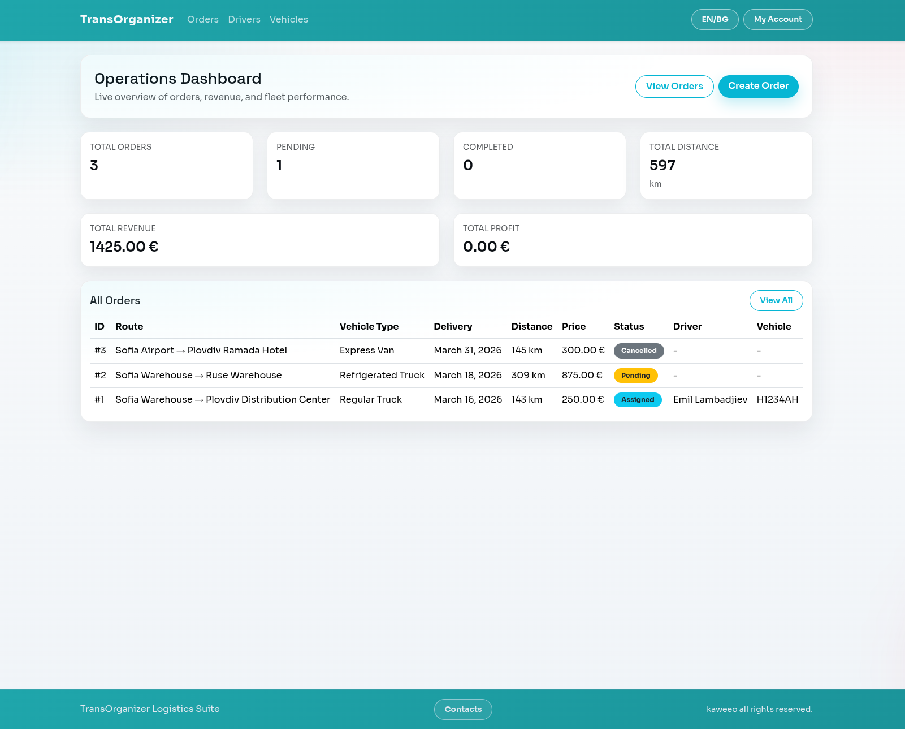
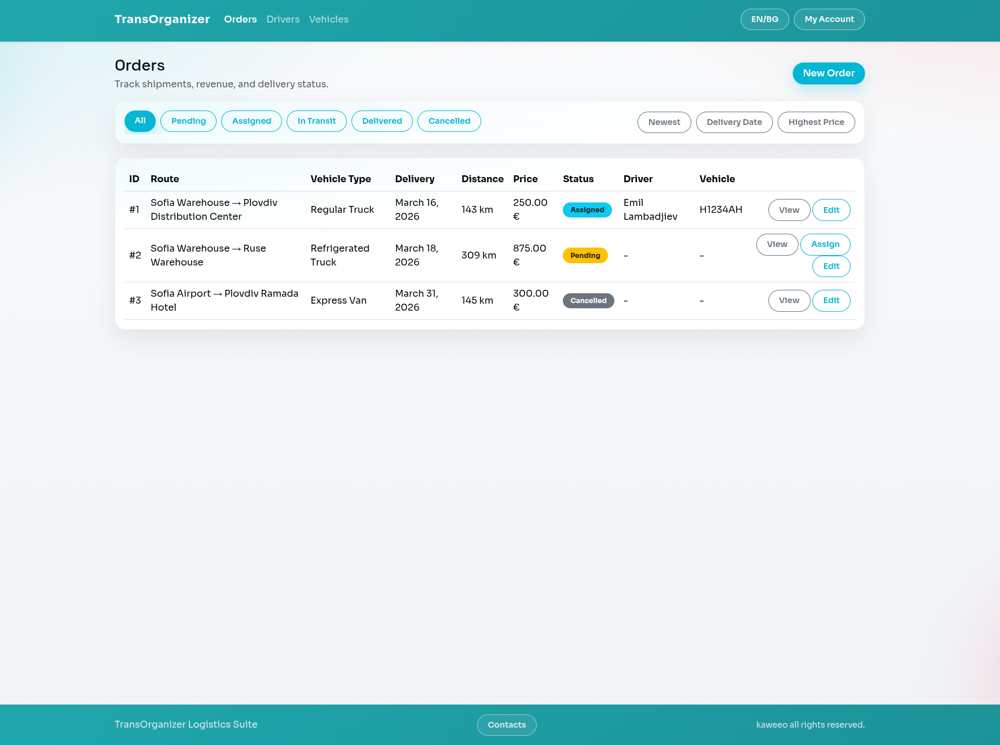
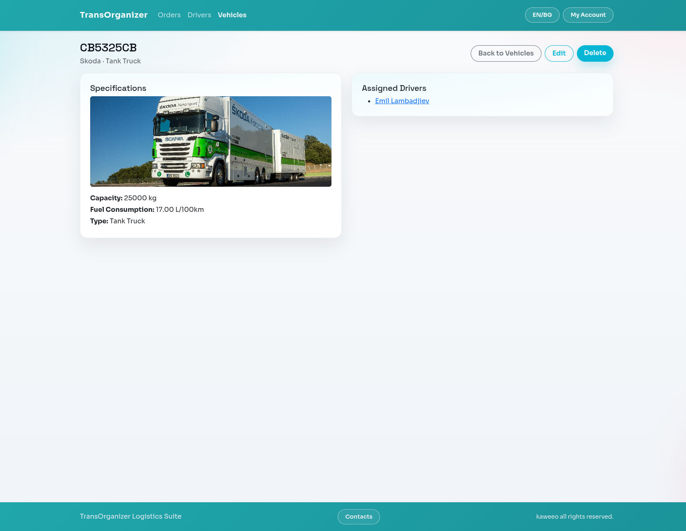

# TransOrganizer

A Django-based logistics management app for orders, drivers, and vehicles.

## Database Schema (Simplified)

- Driver
  - id (PK)
  - name
  - license_number
  - phone_number
  - hired_date
  - photo_url
- Vehicle
  - id (PK)
  - plate_number (unique)
  - brand
  - photo_url
  - capacity
  - fuel_consumption
  - vehicle_type
- Order
  - id (PK)
  - origin
  - destination
  - delivery_date
  - vehicle_type
  - distance_km
  - cargo_weight
  - price
  - fuel_price
  - status
  - driver_id (FK -> Driver, nullable)
  - vehicle_id (FK -> Vehicle, nullable)
- VehicleDriver (implicit M2M table)
  - vehicle_id (FK -> Vehicle)
  - driver_id (FK -> Driver)

## Local Setup

### 1) Create a virtual environment and install dependencies

```bash
python3 -m venv .venv
. .venv/bin/activate
pip install -r requirements.txt
```

### 2) Configure environment variables

Copy the example env file and fill in your own values:

```bash
cp .env.example .env
```

Required variables:
- `DB_NAME`
- `DB_USER`
- `DB_PASSWORD`
- `DB_HOST`
- `DB_PORT`

### 3) Create the database

```bash
psql -U postgres -h 127.0.0.1 -p 5432 -c "CREATE DATABASE your_db_name;"
```

### 4) Run migrations and start the server

```bash
. .venv/bin/activate
python manage.py migrate
python manage.py runserver
```

## Notes

- The app uses PostgreSQL for local development and testing.
- Environment variables are loaded from `.env` using `python-decouple`.

## Documentation Assets

- `docs/screenshots/`

```md



```
